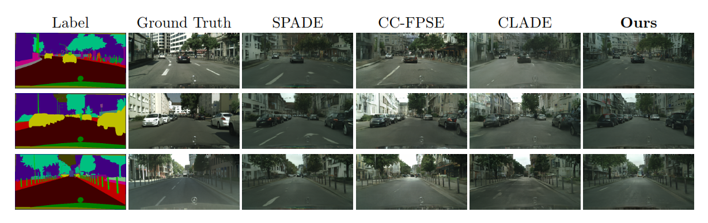
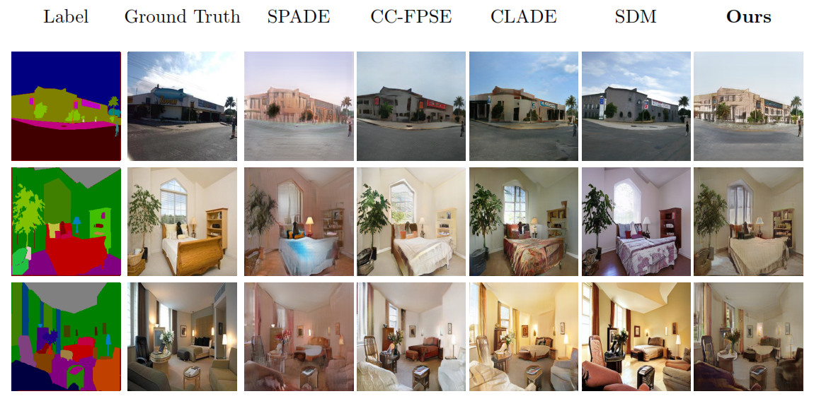

# Semantic Image Synthesis Manipulation for Stability Problem using Generative Adversarial Networks (ULBPGAN)

&nbsp;

  

&nbsp;

  

&nbsp;

[Karim Magdy](https://scholar.google.com/citations?user=v4wnV7QAAAAJ), [Ghada Khoriba](https://scholar.google.com/citations?hl=en&user=jwTBsIIAAAAJ), [Hala Abbas](https://scholar.google.com/citations?hl=en&user=s8EB22cAAAAJ)

## Abstract

Semantic image synthesis is one of the most common tasks regarding image-to-image translation. Generative Adversarial
Networks(GAN) models for semantic image synthesis gained more success, but it lacks structural and spatial information,
leading to unsatisfactory quality of the synthesized image and a significant gap between photo-realistic and synthesized
images’ quality. In this paper, we propose a new generative adversarial network-based approach that can produce
high-resolution images from semantic label maps, reduce this gap, display better-detailed information for the generated
image, and produce better results. The proposed method first uses a local binary pattern convolutional generator,
which produces a local binary pattern feature map. Then, it obtains a global convolutional generator fed from the
segmentation map and the feature map via the learned modulation of a multi-feature adaptive denormalization layer
(MFADE) during the training process to generate a photo-realistic image. Furthermore, the performance of the proposed
method is verified using Cityscapes, ADE20K, and COCO-stuff datasets, and the experimental results demonstrate its
accuracy and strong robustness against the evaluation protocol used in semantic image synthesis tasks.

## Example Results
* **Cityscapes:**

  
  

* **ADE20K:**

  
  

## Prerequisites
- Linux
- Python 3
- CPU or NVIDIA GPU + CUDA CuDNN

## Dataset Preparation
The Cityscapes and ADE20K dataset can be downloaded and prepared following [SPADE](https://github.com/NVlabs/SPADE.git). 

#### Pretrained Models (to be updated)
Will updated soon... 

### Acknowledge
This code borrows heavily from SPADE. 
 
